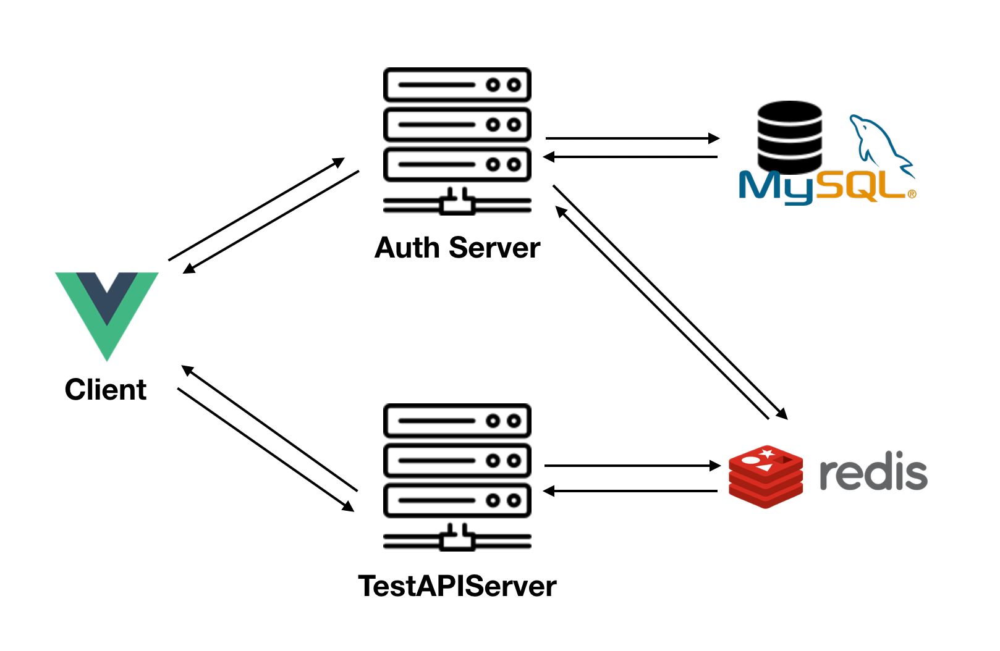

<<<<<<< HEAD
# codemix-vanilla-react

Template for project creation of Vue inside CodeMix

# Contents

This template project is just an example Hello World that guide you through the use of Vue to build a very simple web application that display the Hello World!!! Greeting.

This example has been started with the vue-cli and webpack-simple

# Project setup
```
npm install
```

### Compiles and hot-reloads for development
```
npm run serve
```

### Compiles and minifies for production
```
npm run build
```

### Run your tests
```
npm run test
```

### Lints and fixes files
```
npm run lint
```
=======
# AuthSystem-Client
AuthSystem-Client
>>>>>>> branch 'master' of https://github.com/leeyunjea/AuthSystem-Client.git

#### AuthServer - Spring boot
  * Login
  * Sing Up
  * Admin
#### TestAPIServer - Spring boot
  * helloworld
  
#### Client - vue js

### [AuthSystem-Architecture]


